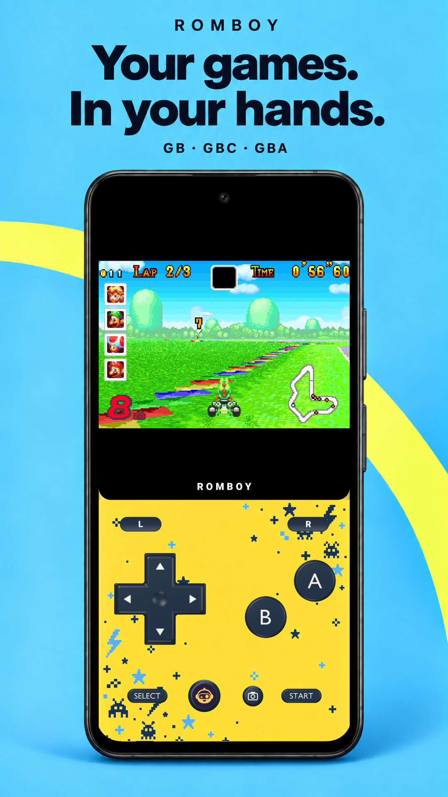
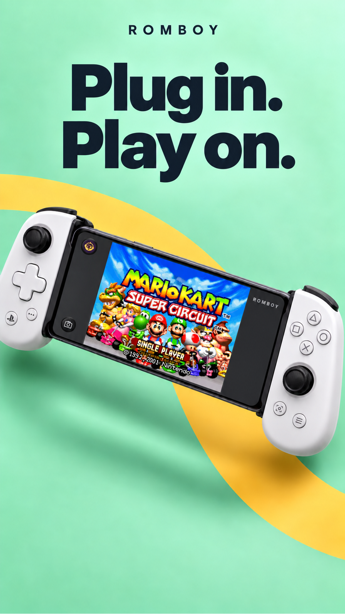
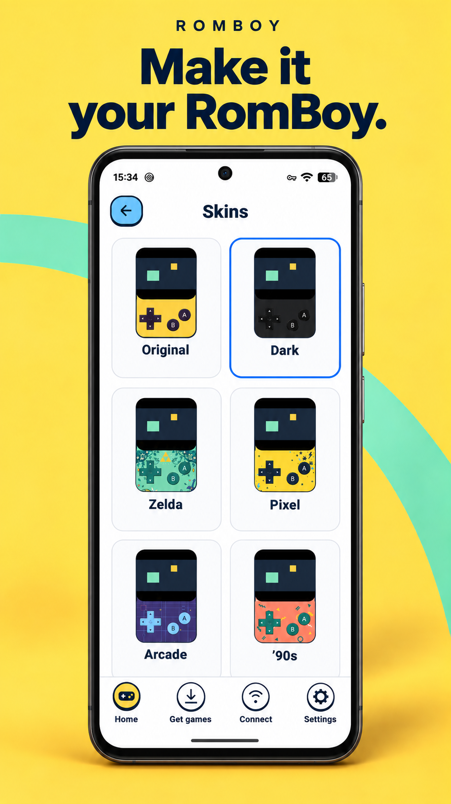
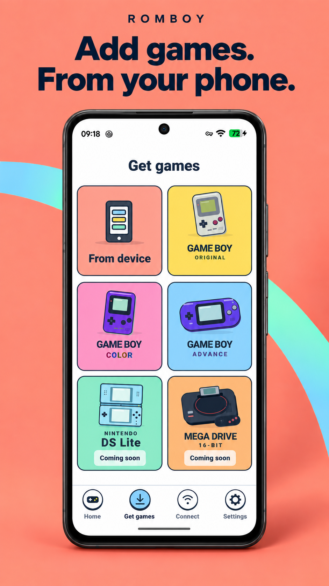
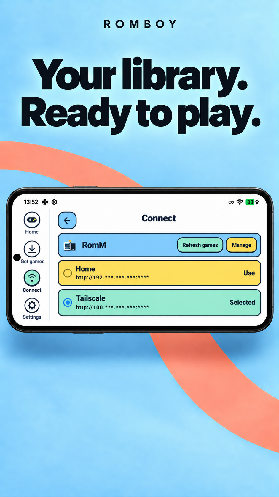
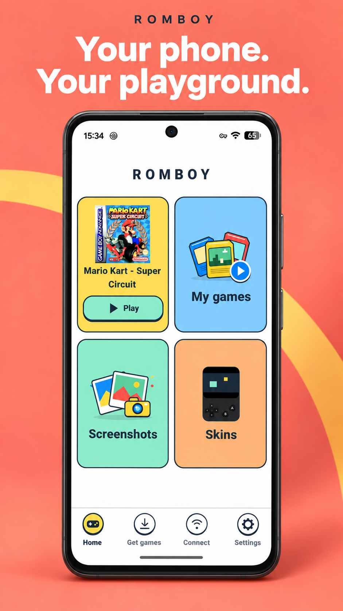
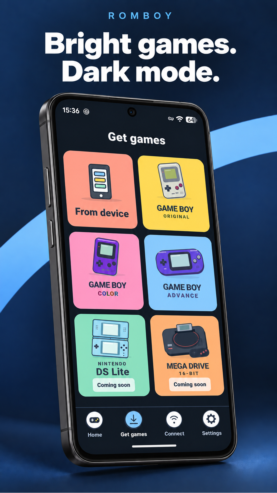
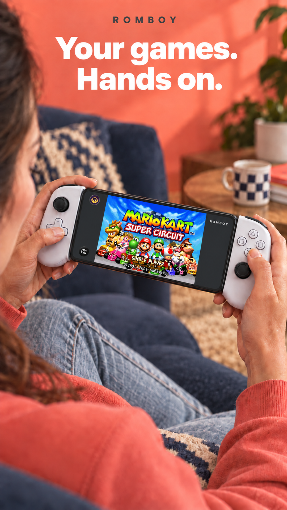

# RomBoy

### Your games. In your hands.

Retro gaming on Android, with built-in emulation, offline play and customisable skins.

**In development · GB / GBC / GBA · Android**

[Join the beta](https://docs.google.com/forms/d/e/1FAIpQLSdVWGCNsiKHqh1iCb71eR9xDIjbLoFTNzuqHjNhJQYprzpiQw/viewform) · [Getting started](GETTING_STARTED.md) · [Roadmap](ROADMAP.md) · [Development updates](UPDATES.md) · [Support and feedback](SUPPORT.md)

<table>
<tr>
<td width="33%"></td>
<td width="33%"></td>
<td width="33%"></td>
</tr>
</table>

## Pick a game. Take it with you.

RomBoy brings your retro collection into one Android app. Import games from your phone, or connect to your own compatible RomM server and choose what to download. Game Boy, Game Boy Color and Game Boy Advance emulation is built in. Once a game is on your phone, you can play offline.

RomBoy is being developed around everyday phone use: a collection you can browse at a glance, touch controls you can personalise, and compatible controllers for longer sessions. Your latest game stays close at hand, so getting back to it takes less searching.

## Inside RomBoy

| Feature | What you can do |
| --- | --- |
| **Built-in emulation** | Play GB, GBC and GBA games within the app. |
| **Local imports** | Add compatible ROM files from your device. A server is optional. |
| **Connected collection** | Browse a compatible RomM server and download selected games, with progress, pause, resume and retry controls. |
| **Offline play** | Play games already downloaded or imported onto your phone. |
| **Saves and backups** | Keep saves on your device, with automatic server backup for games linked to your library when the server supports it. Restore supported saves, import or export save files, and choose between conflicting versions. |
| **Storage control** | Remove a downloaded game while retaining its saves and the original on your server. |
| **Your controls** | Use the touchscreen or a compatible controller, with customisable gameplay skins. |
| **Your library** | Browse cover artwork, search your on-device games and return to recently played titles. |
| **Dark mode and captures** | Switch the app to dark mode, capture gameplay screenshots, then view and share them from the album. |

Server features require a compatible RomM server and the necessary account permissions. Backups need a connection and server-side save support; local games and downloaded games can be played offline.

## A closer look

<table>
<tr>
<td width="33%"></td>
<td width="33%"></td>
<td width="33%"></td>
</tr>
<tr>
<td width="33%"></td>
<td width="33%"></td>
<td width="33%"><strong>Follow the development</strong>  See what is available in the current build, what is planned next, and how to share feedback.  <a href="ROADMAP.md">View the roadmap</a> <a href="SUPPORT.md">Support and feedback</a></td>
</tr>
</table>

## Join the RomBoy beta

Try RomBoy on your Android phone and help shape the app with honest feedback. Internal testers can install the beta **free through Google Play**.

**Limited places. First come, first served.** Google Play allows a maximum of **100 internal testers in total**, including existing testers. Available places are allocated in sign-up order.

**[Request a beta place →](https://docs.google.com/forms/d/e/1FAIpQLSdVWGCNsiKHqh1iCb71eR9xDIjbLoFTNzuqHjNhJQYprzpiQw/viewform)**

Use the email address you use for Google Play. Signing up requests a place; it does not provide immediate access. If a place is available, you will receive an invitation and installation instructions by email. If the test is full, we will contact you if a place opens. Please submit only once.

You will need a compatible Android device and your own compatible game files. Sign-up details are used to manage testing and are not published on GitHub. Once invited, use the [feedback forms](https://github.com/NatLego/RomBoy/issues/new/choose) to report problems and suggest improvements.

## Release plans

RomBoy is in development and preparing for Google Play release. Beta sign-up is open above; installation invitations are sent separately to accepted testers. A public store download link will be added when available.

The planned release is a single purchase, with no advertising or subscription. Future app updates are included for existing buyers.

RomBoy's developer is building an original Sega Mega Drive / Genesis core. Nintendo DS support is planned, with additional systems under consideration. Remote two-player play is also a research direction, with no guarantee of release. See the [roadmap](ROADMAP.md) for the aims and status of each project.

## Follow along

Use [Issues](https://github.com/NatLego/RomBoy/issues) to report a problem or suggest a feature. Development notes live in [Updates](UPDATES.md). This repository contains RomBoy's public showcase, documentation and feedback; the app source is developed privately.

Games are not included. Use compatible ROM files you have the right to use. Screenshots and phone mock-ups illustrate the app; game artwork belongs to its respective owners.

RomBoy is independently developed and is not affiliated with or endorsed by the RomM project, Nintendo or Backbone.
