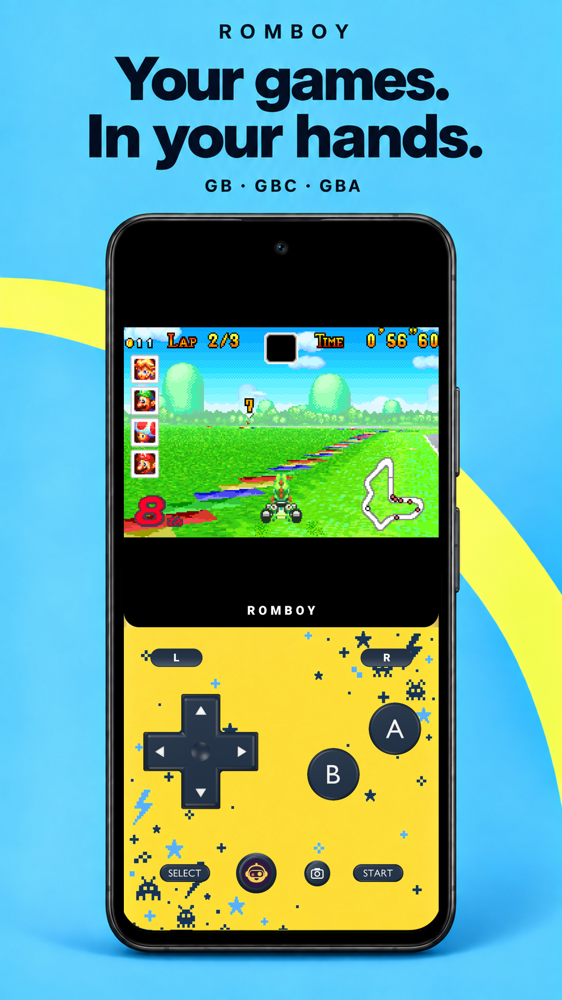
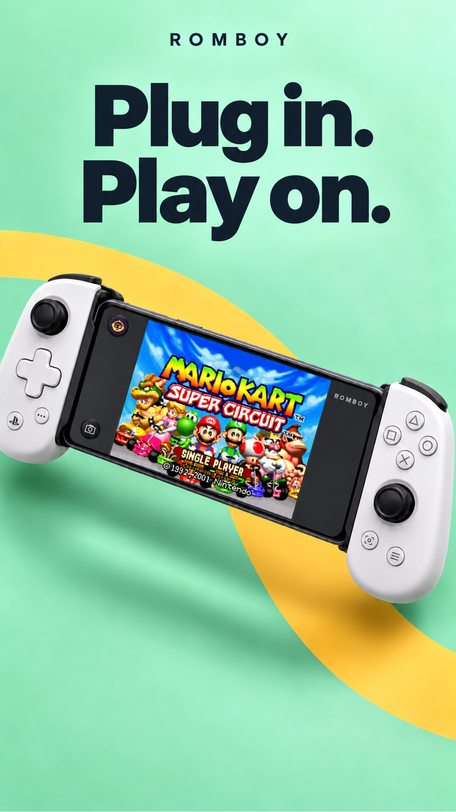
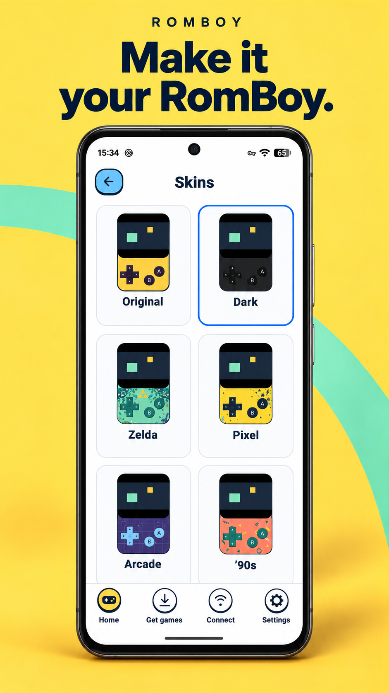
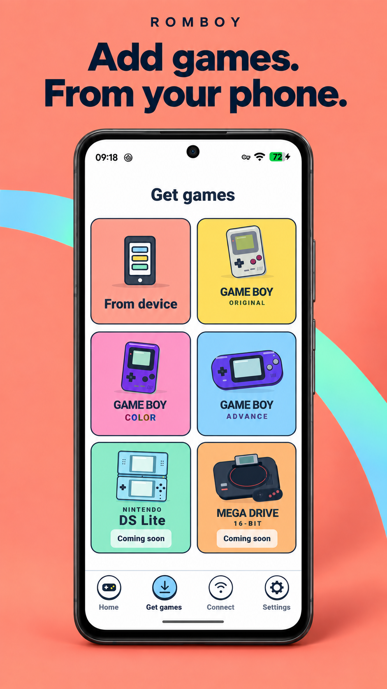
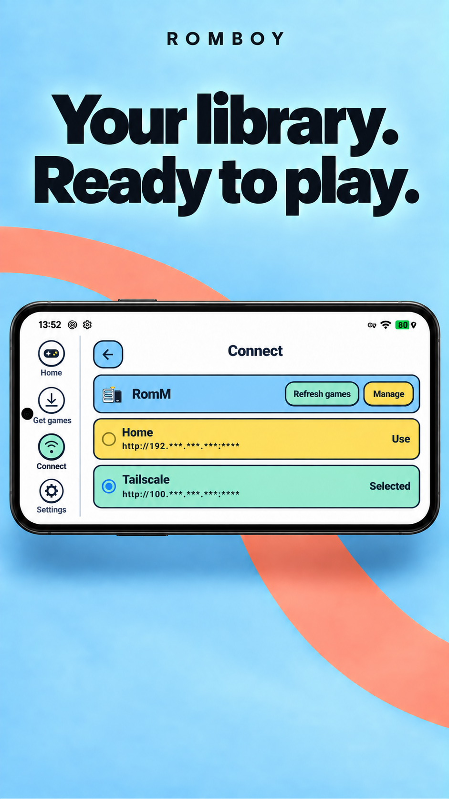
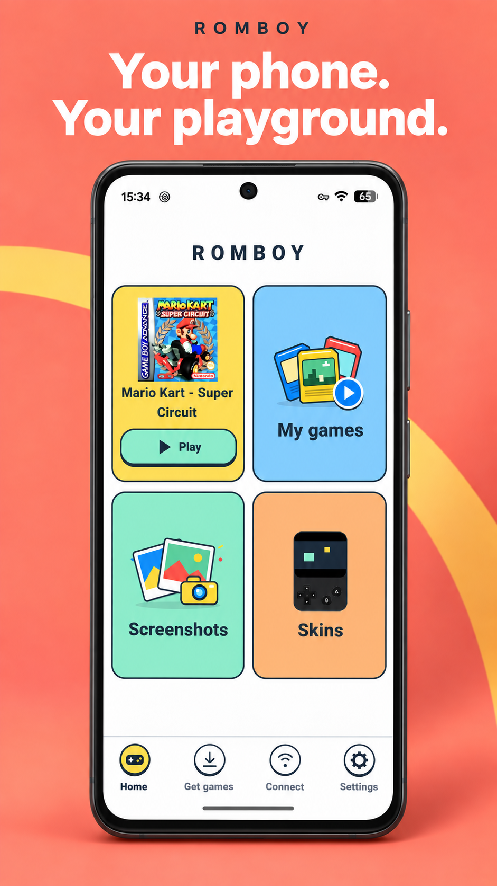
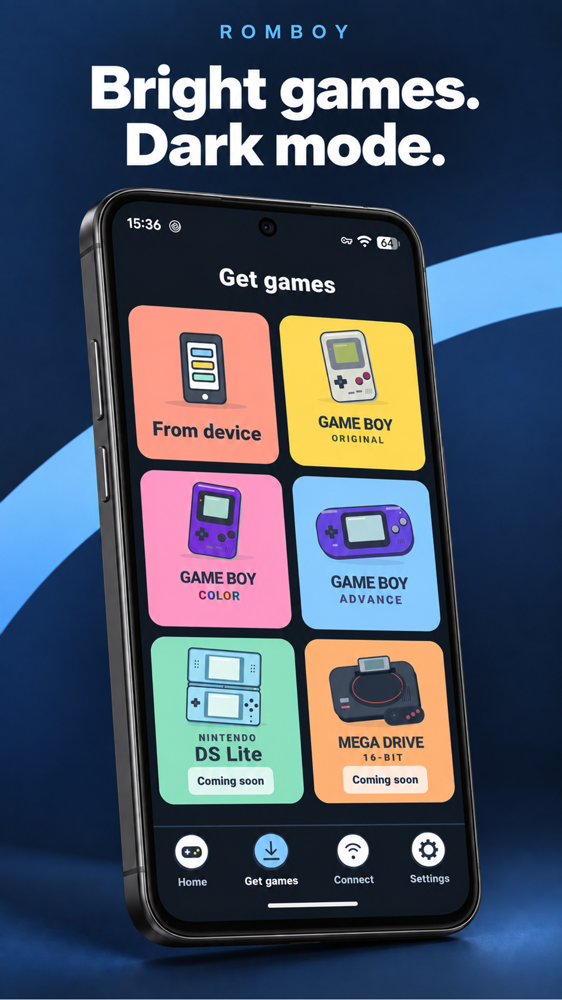
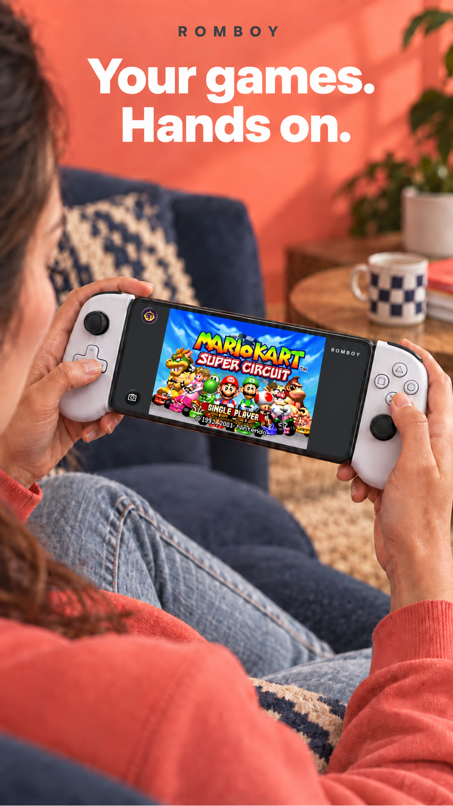

# RomBoy

### Your games. In your hands.

Retro gaming on Android, with built-in emulation, offline play and customisable skins.

**Production pending · GB / GBC / GBA · Android**

[Getting started](GETTING_STARTED.md) · [Roadmap](ROADMAP.md) · [Development updates](UPDATES.md) · [Support and feedback](SUPPORT.md)

<table>
<tr>
<td width="33%"></td>
<td width="33%"></td>
<td width="33%"></td>
</tr>
</table>

## Play on your phone or handheld

RomBoy is an independently developed retro game emulator for Android. Import games from your phone, or connect to your own compatible RomM server and choose what to download. Game Boy, Game Boy Color and Game Boy Advance emulation is built in. Once a game is on your phone, you can play offline.

Browse your collection by cover artwork, search for a game or return to something you played recently. You can customise the touch-control skins or connect a compatible controller.

## Inside RomBoy

| Feature | What you can do |
| --- | --- |
| Built-in emulation | Play GB, GBC and GBA games within the app. |
| Local imports | Add compatible ROM files from your device. A server is optional. |
| Connected collection | Browse a compatible RomM server and download selected games, with progress, pause, resume and retry controls. |
| Offline play | Play games already downloaded or imported onto your phone. |
| Saves and backups | Keep saves on your device, with automatic server backup for games linked to your library when the server supports it. Restore supported saves, import or export save files, and choose between conflicting versions. |
| Storage control | Remove a downloaded game while retaining its saves and the original on your server. |
| Your controls | Use the touchscreen or a compatible controller, with customisable gameplay skins. |
| Dual-screen play | Use both built-in screens on AYN Thor, with a companion dashboard and the option to move gameplay between screens. |
| Your library | Browse cover artwork, search your on-device games and return to recently played titles. |
| Dark mode and captures | Switch the app to dark mode, capture gameplay screenshots, then view and share them from the album. |

Server features require a compatible RomM server and the necessary account permissions. Backups need a connection and server-side save support; local games and downloaded games can be played offline.

## A closer look

<table>
<tr>
<td width="33%"></td>
<td width="33%"></td>
<td width="33%"></td>
</tr>
<tr>
<td width="33%"></td>
<td width="33%"></td>
<td width="33%"><strong>Follow the development</strong>  Read about current features and future plans, or send feedback.  <a href="ROADMAP.md">View the roadmap</a> <a href="SUPPORT.md">Support and feedback</a></td>
</tr>
</table>

## Release plans

Production pending. [Google Play listing](https://play.google.com/store/apps/details?id=dev.romboy.app) · [Development updates](UPDATES.md)

RomBoy is planned as a one-time purchase, with no ads or subscription. Future app updates will be included.

RomBoy's developer is building an original Sega Mega Drive / Genesis core. Nintendo DS support is planned, with additional systems under consideration. Remote two-player play is being considered, but may not be released. See the [roadmap](ROADMAP.md) for details.

## Follow along

Use [Issues](https://github.com/NatLego/RomBoy/issues) to report a problem or suggest a feature, and [Discussions](https://github.com/NatLego/RomBoy/discussions) for questions and conversation. Read the [privacy policy](https://letmehelp-romboy.web.app/privacy-policy/). Read development notes in [Updates](UPDATES.md). This GitHub page is for information and community feedback. RomBoy's source code is private.

Games are not included. Use compatible ROM files you have the right to use. Screenshots and phone mock-ups illustrate the app; game artwork belongs to its respective owners.

